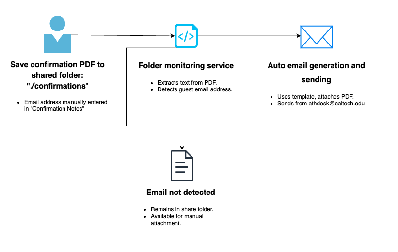

# Automated Confirmation Email Sender

This project automates the emailing of reservation confirmation PDFs generated by the legacy Innfinity PMS at the Caltech Athenaeum. It reads PDFs from a shared folder, extracts the guest email address from the Notes section, and sends the PDF using a shared mailbox.

## 📊 Workflow Diagram



> This diagram shows the process of saving PDFs, extracting guest emails, automatically sending confirmations, and manual fallback handling.

## Features
- Monitors a folder for new PDFs
- Extracts guest email using regex
- Sends email via Microsoft 365 SMTP
- Maintains manual workflow if preferred
- Designed for integration with `athdesk@caltech.edu` shared mailbox

## Requirements
- Python 3.10+
- Microsoft 365 mailbox credentials
- Environment variable for SMTP password

## Setup

Install dependencies:

```bash
pip install fitz watchdog
```

Create a `.env` file or set an environment variable:

```bash
SMTP_PASSWORD=your_app_password
```

## Folder Structure

```plaintext
confirmations/        # Watched folder for new PDFs
manual_review/        # PDFs moved here if no email is found
```

## Usage

Run the script:

```bash
python main.py
```

When a new PDF is saved to the `confirmations` folder, the script will:
1. Extract the guest email
2. Generate a templated email
3. Attach the PDF
4. Send it from `athdesk@caltech.edu`
5. Log success or move PDF to `manual_review` if no email is found

## Microsoft 365 Setup

Make sure SMTP is enabled and app passwords are allowed or use Microsoft Graph API for a more secure option.

## Future Enhancements
- GUI interface for non-technical users
- Integration with Microsoft Graph API
- Azure deployment for 24/7 automation
- Add guest name personalization

---

Developed by Adrian Padron  
Front Desk Automation Initiative – Caltech Athenaeum
